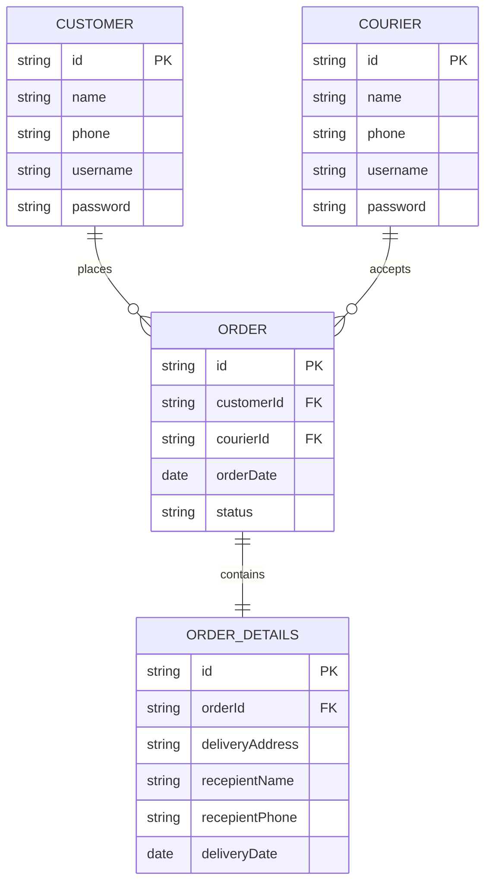

```mermaid
erDiagram
    CUSTOMER ||--o{ ORDER : places
    COURIER ||--o{ ORDER : accepts
    ORDER ||--|| ORDER_DETAILS : contains
    
    COURIER {
        string id PK
        string name
        string phone
        string username
        string password        
    }    
    CUSTOMER {
        string id PK
        string name
        string phone
        string username
        string password        
    }
    ORDER {
        string id PK
        string customerId FK
        string courierId FK        
        date orderDate        
        string status
    }
    ORDER_DETAILS {
        string id PK
        string orderId FK
        string deliveryAddress
        string recepientName
        string recepientPhone   
        date deliveryDate     
    }   
```    