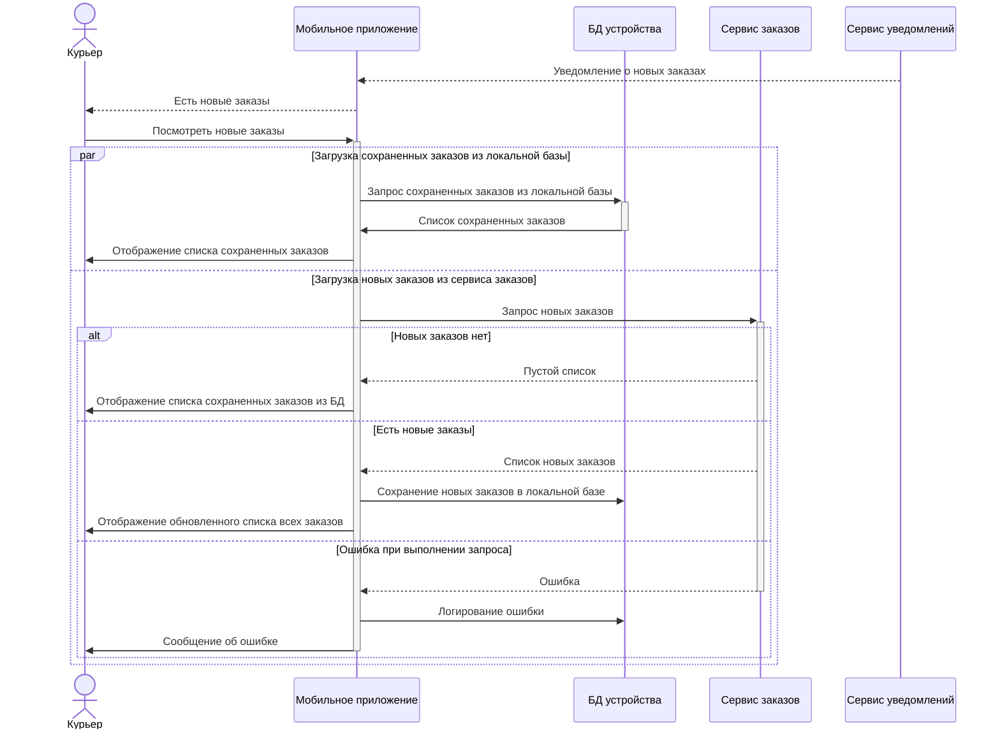

```mermaid
sequenceDiagram
    actor user as Курьер    
    participant app as Мобильное приложение
    participant db_mobile as БД устройства
    participant order_service as Сервис заказов
    participant notification_service as Сервис уведомлений 

    notification_service -->> app : Уведомление о новых заказах
    app -->> user : Есть новые заказы
    user ->> +app : Посмотреть новые заказы 
    
    par Загрузка сохраненных заказов из локальной базы
        app ->> +db_mobile :Запрос сохраненных заказов из локальной базы
        db_mobile ->> -app : Список сохраненных заказов
        app ->> user : Отображение списка сохраненных заказов
    and Загрузка новых заказов из сервиса заказов
        app ->> +order_service : Запрос новых заказов
    alt Новых заказов нет
        order_service -->> app : Пустой список
        app ->> user : Отображение списка сохраненных заказов из БД
    else Есть новые заказы
        order_service -->> app : Список новых заказов
        app ->> db_mobile : Сохранение новых заказов в локальной базе  
        app ->> user : Отображение обновленного списка всех заказов
    else Ошибка при выполнении запроса
        order_service -->> -app : Ошибка
        app ->> db_mobile : Логирование ошибки
        app ->> -user : Сообщение об ошибке    
end
end
```
