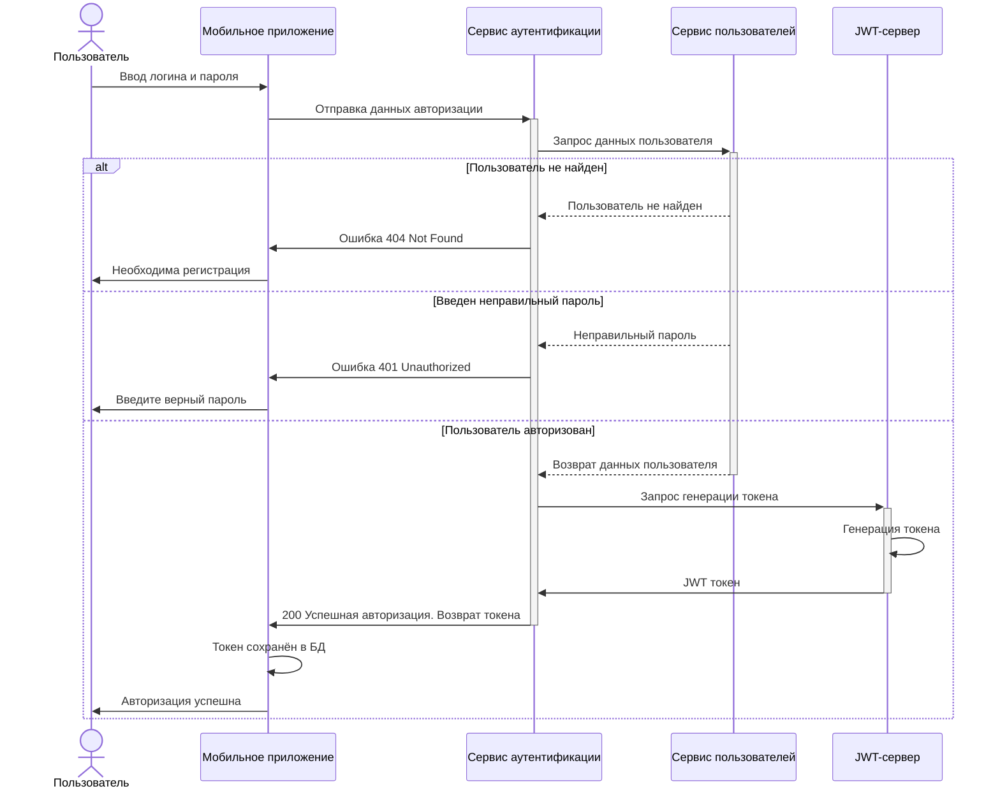

```mermaid
sequenceDiagram
    actor user as Пользователь
    participant app as Мобильное приложение
    participant auth_service as Сервис аутентификации
    participant user_service as Сервис пользователей
    participant jwt as JWT-сервер

    user ->> app: Ввод логина и пароля
    app ->> +auth_service: Отправка данных авторизации
    auth_service ->> +user_service: Запрос данных пользователя

    alt Пользователь не найден
    user_service -->> auth_service: Пользователь не найден
    auth_service ->> app: Ошибка 404 Not Found 
    app ->> user: Необходима регистрация
    else Введен неправильный пароль
    user_service -->> auth_service: Неправильный пароль
    auth_service ->> app: Ошибка 401 Unauthorized 
    app ->> user: Введите верный пароль
    else Пользователь авторизован
    user_service -->> -auth_service: Возврат данных пользователя
    auth_service ->> +jwt: Запрос генерации токена
    jwt ->> jwt: Генерация токена
    jwt ->> -auth_service: JWT токен
    auth_service ->> -app: 200 Успешная авторизация. Возврат токена    
    app ->> app: Токен сохранён в БД
    app ->> user: Авторизация успешна
    end
```